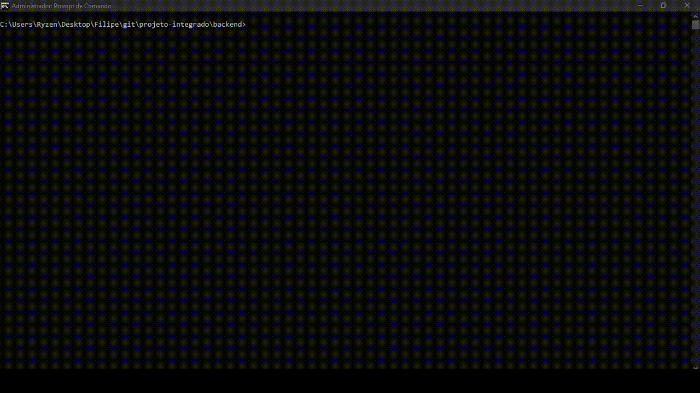

# SISVE - Sistema de Vendas e Estoque

## Autores

* Elaine Dias Pires
* Filipe Gomes Arante de Souza
* Juliana Camilo Repossi

## Sobre

O SISVE é uma aplicação web de interface facilitada para controle de estoques e de venda direcionada a pequenos empreendedores.

## Principais Funcionalidades

* Cadastrar lojas;
* Cadastrar e consultar produtos;
* Efetuar vendas;

## Tecnologias Utilizadas

* **Node.js** para o backend e execução testes automatizados.
* **MongoDB** para o banco de dados.
* **Swagger** para documentar a API do backend.
* **ReactJS** e **Bootstrap** para o frontend.

## Instalação

Para utilizar o SISVE, execute os seguintes passos:

* Clone o repositório do github em sua máquina local;

* Na pasta raiz do projeto, rode os comandos abaixo no terminal para instalar as dependências:
```
cd backend
npm i
cd ..

cd frontend/sisve
npm i
cd ..
```

## Iniciando servidor do backend
Acesse o diretório **backend** e efetue os seguintes passos:

* Crie um arquivo com nome **.env**;
* Copie o que está no arquivo **.env.example** para o arquivo **.env**;

* Execute o comando abaixo no terminal:

```
node .
```
O servidor rodará na porta 8000.

## Iniciando servidor do frontend
Acesse o diretório **frontend/sisve** e efetue o seguinte passo:

* Execute o comando abaixo no terminal:

```
npm run dev
```

O terminal retornará uma mensagem com a url para acessar a aplicação.

## Backend

### Documentação da API
Todos os endpoints do backend foram documentados com a ferramenta Swagger para facilitar o desenvolvimento do sistema num geral. Após iniciar o servidor do backend, acesse a url abaixo:

```
http://localhost:8000/docs
```

Nesta janela é possível consultar o que cada rota faz, bem como seus modelos de requisição e respostas, além de enviar requisições manualmente para o backend.

Veja uma prévia desta janela:


### Testes Automatizados
Para efetuar os testes automatizados, foi utilizado o módulo **JestJS**. Para cada um dos endpoints, foram testados todos os fluxos (normais e variantes) ao mandar requisições para o backend.

Para executar o script de testes, acesse a pasta **backend** e digite o seguinte comando:

```
npm run test
```

Veja abaixo exemplo desta execução:



## Apresentação do SISVE 
<a href="https://youtu.be/Q33C89V5K4M">Clique aqui</a> para ver brevemente o vídeo do funcionamento do sistema para o usuário.
